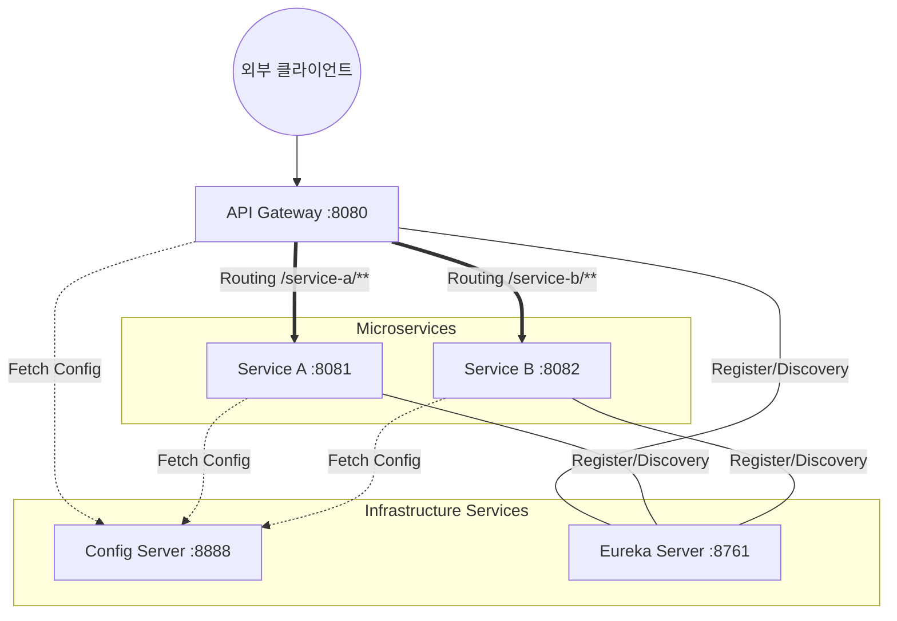

## 1. 프로젝트 개요

### 1-1. 목적

이 프로젝트는 실무형 MSA(Microservice Architecture)의 핵심 컴포넌트를 직접 구성하며 서비스 간 유기적인 결합과 운영 원리를 체득하기 위한 **학습용 Skeleton 프로젝트**입니다.

1. **MSA 핵심 아키텍처 설계 및 서비스 격리**
    - 논리적으로 분리된 다수의 서비스(Service A, B)로 구조화.
2. **Spring Cloud Netflix Eureka를 통한 동적 서비스 탐색(Discovery)**
    - 중앙 집중식 서비스 레지스트리(Eureka Server) 구축.
    - 서비스가 동적으로 생성/소멸될 때 서비스 이름으로 통신하는 **Service Discovery** 메커니즘 실습.
3. **API Gateway를 통한 단일 진입점 구축**
    - 클라이언트와 내부 마이크로서비스 간의 통신을 중재하는 Gateway 서비스 구현.
    - 라우팅 및 보안, 공통 필터링 처리를 위한 관문 역할을 이해.
4. **중앙 집중식 설정 관리 (Config Server)**
    - 각 서비스에 흩어진 설정을 하나의 서버에서 관리하고, 런타임에 설정을 갱신하는 환경 구축.
5. **시스템 가시성 및 가용성 검증 (Health-Check & Actuator)**
    - Spring Boot Actuator를 통해 개별 서비스의 실시간 가동 상태(UP/DOWN)를 모니터링.

### 1-2. 주요 구현 및 기술적 특징

현재 프로젝트는 다음과 같은 구체적인 MSA 기술 요소들이 실제 코드로 구현되어 있습니다.

1. **중앙 집중식 서비스 레지스트리 (Eureka Server)**
    - `@EnableEurekaServer` 어노테이션을 통해 서비스 레지스트리 활성화.
    - 모든 마이크로서비스(Gateway, Service A, B)가 기동 시 자신의 정보를 `[http://localhost:8761/eureka/`에](http://localhost:8761/eureka/%60%EC%97%90)  동적으로 등록하도록 설정.
2. **외부 구성 정보 관리 (Config Server)**
    - `@EnableConfigServer`를 사용하여 개별 서비스의 설정(yml)을 통합 관리.
    - **Native Storage 방식**: 프로젝트 내부의 `src/main/resources/config` 경로에 있는 설정 파일들을 각 서비스에 제공.
    - 포트 번호(8888)를 통해 Gateway 및 각 서비스가 기동 시점에 최신 설정을 주입받도록 구성.
3. **지능형 라우팅 및 로드 밸런싱 (API Gateway)**
    - **Spring Cloud Gateway**를 활용하여 클라이언트의 요청을 적절한 서비스로 라우팅.
    - **LoadBalancer 연동**: `lb://SERVICE-A`와 같은 URI 표현식을 사용하여 Eureka에 등록된 서비스 이름을 기반으로 동적 로드 밸런싱 수행.
    - **Path rewriting**: `StripPrefix=1` 필터를 적용하여 `/service-a/api/...` 요청을 실제 서비스의 `/api/...`로 변환하여 전달.
4. **서비스 상태 모니터링 (Actuator)**
    - **Spring Boot Actuator** 의존성 및 설정을 통해 각 서비스의 `/actuator/health` 엔드포인트 활성화.
    - Gateway 서비스에서 `health`, `info`, `gateway` 엔드포인트를 노출하여 라우팅 상태 및 전체 시스템 건전성을 확인할 수 있는 기반 마련.

### 1-3. 아키텍처 구조


- **요청 흐름 :** Client → API Gateway → Eureka Server 조회 → Service A / Service B
    
    ```mermaid
      sequenceDiagram
          participant Client as 외부 클라이언트<br/>(Postman/Browser)
          participant Gateway as API Gateway<br/>(:8080)
          participant Config as Config Server<br/>(:8888)
          participant Eureka as Eureka Server<br/>(:8761)
          participant ServiceA as Service A<br/>(:8081)
          participant ServiceB as Service B<br/>(:8082)
    
          rect rgb(230, 240, 255)
          Note right of Config: [1단계: 설정 로드] (구동 시 자동 수행)
          Gateway->>Config: GET /api-gateway/default (설정 요청)
          Config-->>Gateway: api-gateway.yml 반환<br/>(port, routes, eureka 주소 등)
    
          ServiceA->>Config: GET /service-a/default (설정 요청)
          Config-->>ServiceA: service-a.yml 반환<br/>(port, eureka 주소 등)
    
          ServiceB->>Config: GET /service-b/default (설정 요청)
          Config-->>ServiceB: service-b.yml 반환<br/>(port, eureka 주소 등)
          end
    
          rect rgb(240, 240, 240)
          Note right of Config: [2단계: 서비스 등록] (설정 로드 후 자동 수행)
          Gateway->>Eureka: 자신의 IP/Port 등록 (api-gateway:8080)
          ServiceA->>Eureka: 자신의 IP/Port 등록 (service-a:8081)
          ServiceB->>Eureka: 자신의 IP/Port 등록 (service-b:8082)
          end
    
          rect rgb(255, 250, 240)
          Note right of Config: [3단계: 외부 라우팅 및 헬스체크 요청]
          Client->>Gateway: HTTP GET /service-a/actuator/health
    
          Note over Gateway, Eureka: Gateway 내부 라우팅 필터 동작<br/>(StripPrefix=1 적용)
          Gateway->>Eureka: "SERVICE-A"의 실제 주소 요청
          Eureka-->>Gateway: Service A 주소 반환 (IP:8081)
    
          Gateway->>ServiceA: HTTP GET /actuator/health (요청 전달)
          ServiceA-->>Gateway: {"status":"UP"} (응답 반환)
    
          Gateway-->>Client: {"status":"UP"} (최종 응답 반환)
          end
    
    ```
    

### 1-4. 기술 스택

<aside>
⚙️

- **Language:** Java 17
- **Framework:** Spring Boot 3.3.5
- **Cloud:** Spring Cloud 2023.0.3
    - **Cloud Dependencies:**
        - Spring Cloud Netflix Eureka Server
        - Spring Cloud Netflix Eureka Client
        - Spring Cloud Congig Server
        - Spring Cloud Gateway
        - Spring Boot Actuator
- **Build Tool:** Gradle 9.4
</aside>

| **Category** | **Technology** | **Version** | **Rationale** |
| --- | --- | --- | --- |
| **Language** | Java | 17 | LTS 버전으로 안정적인 기능과 성능 제공, Spring Boot 3 이상의 필수 요구사항 |
| **Framework** | Spring Boot | 3.3.5 | MSA 개발에 최적화된 독립 실행형 Spring 애플리케이션 구축 프레임워크 |
| **Cloud** | Spring Cloud | 2023.0.3 | 분산 시스템의 공통 패턴(설정 관리, 서비스 탐색, 라우팅 등)을 구현하기 위한 도구 모음 |
| **Build Tool** | Gradle | 9.4.1 | 유연하고 강력한 빌드 자동화 및 의존성 관리 도구 |
- **Spring Cloud Netflix Eureka Server**
    - **용도**: 서비스 레지스트리(중앙 전화번호부) 역할.
    - **이유**: MSA 환경에서는 서비스 인스턴스의 IP와 포트가 동적으로 변하므로, 이를 중앙에서 관리하고 탐색할 수 있는 서버가 필요함.
- **Spring Cloud Netflix Eureka Client**
    - **용도**: 서비스 자동 등록 및 탐색.
    - **이유**: 개별 서비스(A, B, Gateway)가 기동될 때 자신의 위치 정보를 Eureka Server에 등록하고, 다른 서비스와 통신할 때 Eureka를 통해 위치를 찾기 위함.
- **Spring Cloud Config Server**
    - **용도**: 외부 구성 정보(설정값)의 중앙 집중화.
    - **이유**: 서비스가 많아질수록 각각의 `application.yml`을 관리하기 어려워지므로, 설정을 한곳에서 관리하고 런타임에 갱신할 수 있는 환경을 구축하기 위함.
- **Spring Cloud Gateway**
    - **용도**: 시스템의 단일 진입점(API Gateway).
    - **이유**: 클라이언트의 모든 요청을 한곳에서 받아 공통 로직(인증, 필터링 등)을 처리하고, 적절한 내부 서비스로 요청을 라우팅하기 위함.
- **Spring Boot Actuator**
    - **용도**: 애플리케이션 상태 모니터링 및 관리 엔드포인트 제공.
    - **이유**: 서비스의 헬스체크(UP/DOWN), 환경설정 정보, 라우팅 상태 등을 실시간으로 확인하여 시스템 가용성을 보장하기 위함.

### 1-5. 프로젝트 구조

- [프로젝트 구조 tree](./docs/project-tree.md)
     
    ```md
    miniMSA(root)/
    ├── api-gateway/         
    ├── config-server/
    ├── eureka-server/
    ├── service-a/
    └── service-b/
    ```
    
- Repository 전략 👉🏻 **Multi-Module**
    - **Multi-Module [선택✅]**
        - 하나의 루트 프로젝트(단일 Git 리포지토리) 안에 여러 서브모듈을 두는 구조.
        - `settings.gradle`에 각 모듈을 등록하고, 공통 의존성은 루트 `build.gradle`에서 일괄 관리 → 각 모듈은 독립적으로 빌드·배포 가능하지만 코드베이스는 하나로 공유된다.
        - 멀티모듈 선택 이유🤔
            
            **공통 코드 공유가 쉽다, 단일 클론으로 전체 개발 가능, 일관된 빌드 환경**  등의 장점 👉🏻 MSA 구조 탐색을 주요 목적으로 하고 있으므로 더 적합한 전략이라고 판단하였다.
            
    - **Multi-Repository**
        - 각 마이크로서비스를 **완전히 독립된 Git 리포지토리**로 분리하여 운영하는 구조.
        - 각 리포지토리는 자체 CI/CD 파이프라인, 독립적인 배포 주기, 별도의 기술 스택을 가질 수 있다. → 서비스 간 코드 공유는 별도 라이브러리를 패키징·배포하는 방식으로 해결한다.
        
    

---

## 2. 애플리케이션 구조 및 설정

### 2-1. 모듈 구성

|  | build.gradle 설정                                                                                                                                                | application.yml                                                              |
| --- |----------------------------------------------------------------------------------------------------------------------------------------------------------------|------------------------------------------------------------------------------|
| (통합) miniMSA | • `lombok` <br> • `spring-cloud-dependencies BOM`                                                                                                              |                                                                              |
| api-gateway | • `spring-cloud-starter-gateway`<br> • `spring-cloud-starter-netflix-eureka-client` <br> • `spring-cloud-starter-config` <br> • `spring-boot-starter-actuator` | port : 8080                                                                  |
| eureka-server | • `spring-cloud-starter-netflix-eureka-server`                                                                                                                 | port : 8761 <br> `register-with-eureka: false`, <br> `fetch-registry: false` |
| config-server | • `spring-cloud-config-server`                                                                                                                                 | port : 8888 <br> `profiles.active: native`                                   |
| service-a | • `spring-boot-starter-web` <br> • `spring-boot-starter-actuator` <br> • `spring-cloud-starter-netflix-eureka-client` <br> • `spring-cloud-starter-config`     | port : 8081                                                                  |
| service-b | (service-a 와 동일)                                                                                                                                               | port : 8082                                                                  |
- `spring-boot-starter-web` vs. `spring-cloud-starter-gateway`
    - service-a/b :  → Servlet 기반 (일반 actuator)
    - api-gateway :  → WebFlux 기반 (반응형 actuator)
- `spring-cloud-dependencies BOM`
    - 여러 라이브러리 버전을 한 번에 관리
        - Spring Cloud 라이브러리 버전이 모두 맞아야 동작 → 루트 `build.gradle` 에서 한 번만 버전 선언하면, 각 모듈에서는 버전 생략 가능

### 2-2. Eureka Server

- 포트 : 8761
- 역할 : Micro Service들의 주소(IP, Port)를 관리하는 중앙 서버
    - MSA 환경에서는 각 서비스 인스턴스가 동적 생성, 소멸되므로 고정된 IP가 아니라 서비스 ID로 위치 찾을 수 있도록 통신 기반 제공
- 의존성 : `spring-cloud-starter-netflix-eureka-server`
- 설정 : 자기 자신을 registry에 등록하거나, 다른 registry 정보 가져오지 않도록 설정
    - application.yml
        
        ```yaml
        server:
          port: 8761
        spring:
          application:
            name: eureka-server
        eureka:
          client:
            register-with-eureka: false
            fetch-registry: false
        ```
        
    - EurekaServerApplication.java
        
        ```java
        @EnableEurekaServer
        @SpringBootApplication
        public class EurekaServerApplication { ... }
        ```
        
        - cf.  `@EnableEurekaServer`
            - 해당 스프링 부트 애플리케이션을 서비스 디스커버리 서버(Eureka Server)로 동작하게 만드는 핵심 어노테이션
            - **서비스 레지스트리 활성화:** 분산 환경의 마이크로서비스들이 자신의 위치(IP, Port)를 등록하고 관리할 수 있는 **중앙 주소록(Registry)** 기능을 활성화한다.
            - **상태 모니터링:** 등록된 서비스들로부터 주기적인 신호(Heartbeat)를 받아 가용 상태를 실시간으로 파악하고 관리한다.

### 2-3. Config Server

- 포트 : 8888
- 역할 : 분산된 Micro Service들의 설정 파일(application.yml)을 한 곳에서 관리하고, 서비스 기동 시 필요한 설정값을 주입하는 중앙 제어 서버
- 의존성 : `spring-cloud-config-server`
- 설정
    - application.yml
        
        ```yaml
        server:
          port: 8888
        
        spring:
          application:
            name: config-server
          profiles:
            active: native          # 로컬 파일 시스템에서 설정 파일 읽기
          cloud:
            config:
              server:
                native:
                  search-locations: classpath:/config # 실제 설정 파일이 위치한 경로
        ```
        
    - ConfigServerApplication.java
        
        ```java
        @EnableConfigServer // 이 애플리케이션을 Spring Cloud Config 서버로 활성화
        @SpringBootApplication
        public class ConfigServerApplication { ... }
        ```
        
        - cf.  `@EnableConfigServer`
            - 해당 스프링 부트 애플리케이션을 중앙 설정 관리 서버(Config Server)로 동작하게 만드는 핵심 어노테이션
            - **설정 저장소 연결:** 로컬 파일 시스템이나 Git 레포지토리에 저장된 설정 파일(`.yml`, `.properties`)을 읽어올 수 있는 기능을 활성화한다.
            - **HTTP 엔드포인트 노출:** 다른 마이크로서비스들이 HTTP 통신을 통해 자신의 설정 정보를 요청하고 받아갈 수 있도록 REST API 엔드포인트를 자동으로 생성한다.

### 2-4. API Gateway (Spring Cloud Gateway)

- 포트 : 8080
- 역할 : 외부 Client의 모든 요청을 받는 단일 진입점
    - Client가 개별 서비스 주소(8081, 8082 등)를 알 필요 없이 Gateway 주소(8080 port)로만 통신하도록 단일화
    - Eureka Server를 참조해 들어온 요청을 하위 서비스로 라우팅 및 로드밸런싱 하기 위해 구성
- 의존성
    - build.gradle
        
        ```code
        dependencies {
            // API Gateway
            implementation 'org.springframework.cloud:spring-cloud-starter-gateway'
            
            // 인프라 연결: Eureka Discovery Client (위치 등록 및 검색)
            implementation 'org.springframework.cloud:spring-cloud-starter-netflix-eureka-client'
            
            // 설정 주입: Config Client 활성화
            implementation 'org.springframework.cloud:spring-cloud-starter-config'
            
            // 모니터링: Actuator (Health-check 및 라우팅 검증)
            implementation 'org.springframework.boot:spring-boot-starter-actuator'
        }
        ```
        
- 설정
    - application.yml
        
        ```yaml
        spring:
          application:
            name: api-gateway      # config-server에서 api-gateway.yml 파일을 찾는 기준
          config:
            import: optional:configserver:http://localhost:8888 # Config Server로부터 설정 주입
        ```
        
    - config-server 내 api-gateway.yml
        
        ```yaml
        server:
          port: 8080
          
        spring:
          cloud:
            gateway:
              routes:
                - id: service-a-route
                  uri: lb://SERVICE-A # 유레카에 등록된 서비스 이름을 사용하여 로드밸런싱
                  predicates:
                    - Path=/service-a/**
                  filters:
                    - StripPrefix=1 # /service-a 경로를 제거하고 전달
                - id: service-b-route
                  uri: lb://SERVICE-B
                  predicates:
                    - Path=/service-b/**
                  filters:
                    - StripPrefix=1
        eureka:
          client:
            service-url:
              defaultZone: http://localhost:8761/eureka/
              
        management:
          endpoints:
            web:
              exposure:
                include: health, info, gateway
          endpoint:
            gateway:
              enabled: true
        ```
        

### 2-5. 마이크로서비스 - Service A, B

- 포트 : 8081(Service A), 8082(Service B)
- 역할 : 실제 비즈니스 로직이 위치하는 엔드포인트(본 프로젝트에서는 상태 확인/검증을 위한 대상을 담당함)
    - **통신 검증:** Gateway를 통해 들어온 요청이 적절한 서비스 인스턴스로 도달하는지 확인한다.
    - **상태 노출:** `Spring Boot Actuator`를 활용해 자신의 가용 상태(UP/DOWN)를 외부로 알린다.
    - cf. 향후 추가 고려사항: 마이크로서비스 간 연동 및 확장
        1. 마이크로서비스 간 통신 방식
            - **OpenFeign**: 인터페이스 선언만으로 다른 서비스를 호출할 수 있는 **선언적 HTTP 클라이언트.** Eureka 서버와 연동되어 서비스 이름(`SERVICE-B`)만으로 호출이 가능하며, 자동으로 로드밸런싱이 적용된다.
                - 의존성 추가필요: `spring-cloud-starter-openfeign`
                - 어노테이션 적용: 메인 클래스에 `@EnableFeignClients` , 인터페이스에 `@FeignClient(name = "{서비스이름}")`
                - 구현? API 요청을 보내는 쪽(ex. service-a): Client 인터페이스 ↔ 요청을 받는 쪽(ex. service-b): 컨트롤러
            - **RestTemplate**: 스프링에서 제공하는 전통적인 **명령형 HTTP 클라이언트**. 호출 로직을 직접 코드로 제어할 수 있어 세밀한 설정이 가능하다.
        
- 의존성
    - build.gradle
        
        ```code
        dependencies {
            implementation 'org.springframework.boot:spring-boot-starter-web'
        
            // 인프라 연결: Eureka Discovery Client (위치 등록 및 검색)
            implementation 'org.springframework.cloud:spring-cloud-starter-netflix-eureka-client'
        
            // 설정 주입: Config Client 활성화
            implementation 'org.springframework.cloud:spring-cloud-starter-config'
            
            // 모니터링: Actuator (Health-check 및 라우팅 검증)
            implementation 'org.springframework.boot:spring-boot-starter-actuator'
        }
        ```
        
- 설정
    - application.yml
        
        ```yaml
        # Service A 예시 (Service B는 name만 변경)
        spring:
          application:
            name: service-a      # config-server에서 service-a.yml 파일을 찾는 기준
          config:
            import: optional:configserver:http://localhost:8888
        ```
        
    - config-server 내 service-a.yml
        
        ```yaml
        server:
          port: 8081 # Service B는 8082로 설정
        
        eureka:
          client:
            service-url:
              defaultZone: http://localhost:8761/eureka/
        
        management:
          endpoints:
            web:
              exposure:
                include: health  # 헬스체크 엔드포인트 활성화
        ```
        

---

## 3. 동작 검증

### 3-1. API Endpoints

| URL | **설명**                                                  |
| --- |---------------------------------------------------------|
| `GET :8080/actuator/health` | health 체크                                               |
| `GET :8761` | Eureka 대시보드                                             |
| `GET :8080/service-a/actuator/health` | Service A health 체크 <br> (Client → Gateway → Service A) |
| `GET :8080/service-b/actuator/health` | Service B health 체크 <br> (Client → Gateway → Service B) |

### 3-2. 실행 순서

1. `ConfigServerApplication` 실행 (8888 포트)  
모든 서비스의 설정 정보를 제공하는 서버이므로 가장 먼저 기동되어야 한다.
2. `EurekaServerApplication` 실행 (8761 포트)  
각 서비스의 위치를 등록받기 위해 설정 서버 다음으로 실행한다.
3. `ServiceAApplication` 및 `ServiceBApplication` 실행 (8081, 8082 포트)  
설정 서버에서 유레카 주소를 받아온 뒤 자신의 정보를 등록한다.
4. `ApiGatewayApplication` 실행 (8080 포트)  
유레카로부터 서비스 리스트를 받아 라우팅 준비 완료.

### 3-3. 검증 방법

1. **레지스트리 대시보드 확인:**
    - 브라우저에서 `http://localhost:8761` 접속
    - **'Instances currently registered with Eureka'** 섹션 → `API-GATEWAY`, `SERVICE-A`, `SERVICE-B`가 모두 표시되는지 확인
        

        
2. **API Gateway 라우팅 테스트 (Health Check)**
    
    브라우저에서 Gateway 주소로 개별 서비스를 호출하여 응답이 오는지 확인한다.
    
    - **예상 결과:**
        - 상태 코드: `200 OK`
        - 응답 본문: `{"status": "UP"}`
    - **Service A 요청:** `GET http://localhost:8080/service-a/actuator/health`
        
        
        
    - **Service B 요청:** `GET http://localhost:8080/service-b/actuator/health`
        
        
        
3. **Config Server 설정 주입 확인**
    
    브라우저에서 설정 서버가 제공하는 JSON 형태의 설정 데이터가 정상적으로 출력되는지 확인한다. → 실제 마이크로서비스가 기동될 때 어떤 데이터를 받아갈지 미리 검증할 수 있다.
    
    - **예상 결과:**
        - 상태 코드: `200 OK`
        - 응답 본문:
            
            name: 요청한 서비스명 (`service-a`)
            
            profiles: 적용된 환경(`default`)
            
            propertySources: 설정 서버가 읽어온 실제 설정 파일들을 배열 형태로 나열
            
    - `http://localhost:8888/service-a/default` **요청:**
        
        
