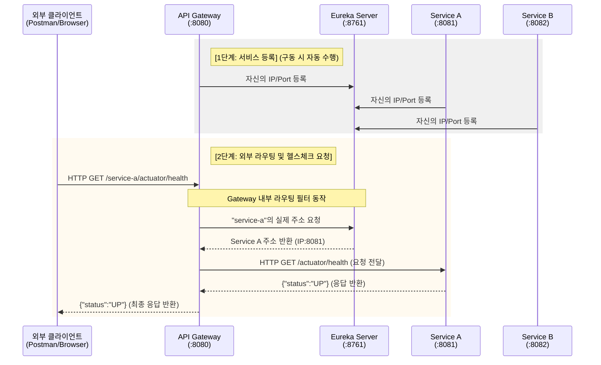

# MSA 미니 프로젝트

날짜: 2026년 5월 6일

<aside>

</aside>

---

## 1. 프로젝트 개요

### 1-1. 목적

1. 로컬 환경에서 MSA의 핵심 동작 원리를 학습한다.
2. Spring Cloud Network Eureka를 이용한 Service Discovery 과정을 이해한다.
3. Spring Boot Actuator의 health-check를 활용해 서비스 간 정상 통신 여부를 검증한다.

### 1-2. 아키텍처 구조

- 요청 흐름 : Client → API Gateway → Service Registry 조회 → Service A, B



### 1-3. 기술 스택

<aside>
⚙️

- **Language:** Java 17 이상
- **Framework:** Spring Boot 3.x
- **Cloud Dependencies:**
    - Spring Cloud Netflix Eureka Server
    - Spring Cloud Netflix Eureka Client
    - Spring Cloud Gateway
    - Spring Boot Actuator
</aside>

## 2. 애플리케이션 구조 및 설정

### 2-1. Eureka Server

- 포트 : 8761
- 역할 : Micro Service들의 주소 (IP, Port) 관리하는 중앙 서버
    - MSA 환경에서는 각 서비스 인스턴스가 동적 생성, 소멸되므로 고정된 IP가 아니라 서비스 ID로 위치 찾을 수 있도록 통신 기반 제공
- 의존성 : `spring-cloud-starter-netflix-eureka-server`
- 설정 : 자기 자신을 registry에 등록하거나, 다른 registry 정보 가져오지 않도록 설정
    
    ```yaml
    server:
      port: 8761
    spring:
      application:
        name: eureka-server
    eureka:
      client:
        register-with-eureka: false
        fetch-registry: false
    ```
    
    ```java
    @EnableEurekaServer
    @SpringBootApplication
    public class EurekaServerApplication { ... }
    ```
    

### 2-2. API Gateway (Spring Cloud Gateway)

- 포트 : 8080
- 역할 : 외부 Client의 요청 받는 단일 진입점
    - Client가 개별 서비스 주소(8081, 8082 등) 알 필요 없이 8080으로만 통신하도록
    - 유레카 서버를 참조해 들어온 요청을 하위 서비스로 라우팅하기 위해 구성
- 의존성 : Gateway, Eureka Discovery Client
- 설정
    - application.yml
        
        ```yaml
        server:
          port: 8080
        spring:
          application:
            name: api-gateway
          cloud:
            gateway:
              routes:
                - id: service-a-route
                  uri: lb://SERVICE-A # 유레카에 등록된 서비스 이름을 사용하여 로드밸런싱
                  predicates:
                    - Path=/service-a/**
                  filters:
                    - StripPrefix=1 # /service-a 경로를 제거하고 전달
                - id: service-b-route
                  uri: lb://SERVICE-B
                  predicates:
                    - Path=/service-b/**
                  filters:
                    - StripPrefix=1
        eureka:
          client:
            service-url:
              defaultZone: http://localhost:8761/eureka/
        ```
        

### 2-3. 마이크로서비스 - Service A, B

- 포트 : 8081
- 역할 : 실제 비즈니스 로직이 위치하는 엔드포인트 (현 프로젝트에서는 상태 확인 기능만 제공)
    - 라우팅이 정상적으로 이루어지는지 검증
    - `spring-boot-starter-actuator` 의존성 추가해 `/actuator/health` 엔드포인트로 UP/DOWN 반환
- 설정
    - application.yml
        
        ```yaml
        server:
          port: 8081 # Service B는 8082로 설정
        spring:
          application:
            name: service-a # Service B는 service-b로 설정
        eureka:
          client:
            service-url:
              defaultZone: http://localhost:8761/eureka/
        management:
          endpoints:
            web:
              exposure:
                include: health # 헬스체크 엔드포인트 노출
        ```
        

## 3. 동작 검증

#### 1) 실행 순서

1. `EurekaServerApplication` 실행 (8761 포트)
2. `ServiceAApplication` 및 `ServiceBApplication` 실행 (8081, 8082 포트)
3. `ApiGatewayApplication` 실행 (8080 포트)

#### 2) 검증 방법

1. **레지스트리 대시보드 확인:**
    - 브라우저에서 `http://localhost:8761` 접속
    - 'Instances currently registered with Eureka' 섹션에 API-GATEWAY, SERVICE-A, SERVICE-B가 표시되는지 확인
2. **API Gateway 라우팅 테스트 (Health Check):**
    - **Service A 요청:** `GET http://localhost:8080/service-a/actuator/health`
    - **Service B 요청:** `GET http://localhost:8080/service-b/actuator/health`
3. **예상 결과:**
    - 상태 코드: `200 OK`
    - 응답 본문: `{"status": "UP"}`
