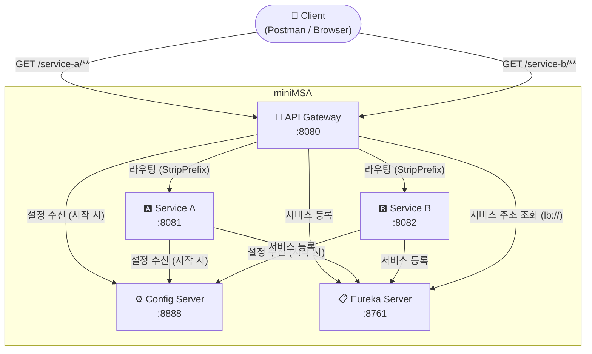
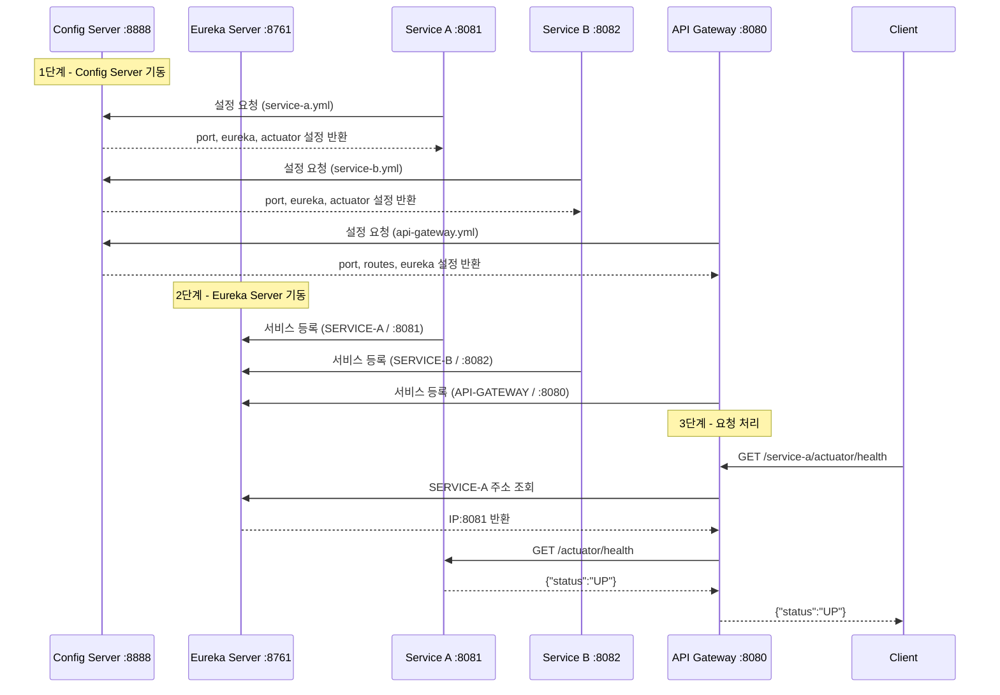

# 서비스 아키텍처

## 전체 구조

## 실행 순서

## 모듈별 역할 요약

| 모듈 | 포트 | 역할 | 주요 의존성 |
|---|---|---|---|
| `config-server` | 8888 | 전 서비스 설정 중앙 관리 | spring-cloud-config-server |
| `eureka-server` | 8761 | 서비스 주소 등록 & 조회 | spring-cloud-starter-netflix-eureka-server |
| `api-gateway` | 8080 | 단일 진입점, 라우팅 | spring-cloud-starter-gateway |
| `service-a` | 8081 | 비즈니스 서비스 A | spring-boot-starter-actuator |
| `service-b` | 8082 | 비즈니스 서비스 B | spring-boot-starter-actuator |

## Health Check 엔드포인트

| 대상 | URL |
|---|---|
| API Gateway 자체 | `GET http://localhost:8080/actuator/health` |
| Service A (Gateway 경유) | `GET http://localhost:8080/service-a/actuator/health` |
| Service B (Gateway 경유) | `GET http://localhost:8080/service-b/actuator/health` |
| Eureka 대시보드 | `http://localhost:8761` |